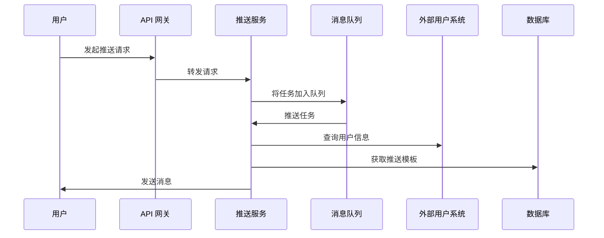

# 消息推送微服务规格文档

## 1. 项目概述

本项目旨在实现一个基于 Spring Boot 3.5.9 的消息推送微服务。该微服务需要支持多种消息推送渠道，并且能够通过 REST API 和 SDK 提供外部调用接口。此外，微服务需要具有高度的可扩展性和解耦设计，以便于集群部署，并与外部用户体系进行外挂集成。

## 2. 需求说明

### 2.1. 功能需求

* **支持多渠道推送：**

  * 支持站内消息推送（WebSocket）。
  * 支持短信推送。
  * 可扩展支持其他渠道，如邮件、APP 推送等。

* **外部用户体系外挂：**

  * 微服务不涉及具体的用户业务，不持有用户信息，只通过外部用户体系的接口与用户信息交互。

* **提供 REST API 与 SDK 调用：**

  * 提供 REST API 供外部系统调用。
  * 提供 SDK，便于集成到其他服务中。

* **可扩展性和解耦：**

  * 消息推送服务要具有高度的可扩展性，方便后续增加新的推送渠道。
  * 系统内不同模块应尽量解耦，增强模块间的独立性。

* **集群部署：**

  * 支持分布式和集群部署，能够在多节点环境下平滑运行。

### 2.2. 非功能需求

* **高可用性：** 微服务应具备自动故障恢复、负载均衡等特性，保证系统的高可用性。
* **性能：** 具备处理高并发请求的能力，能够快速推送消息。
* **安全性：** 消息的传输应加密，API 请求应支持认证与授权。
* **日志与监控：** 支持日志记录和监控，以便于运维人员管理和排查问题。

## 3. 技术栈

* **后端框架：** Spring Boot 3.5.9
* **消息队列：** Kafka / RabbitMQ（用于解耦推送任务）
* **数据库：** MySQL 或 MongoDB（存储推送记录、用户信息等）
* **WebSocket 实现：** Spring WebSocket
* **短信推送：** 第三方短信服务商（如 Twilio, 阿里云短信等）
* **REST API：** Spring WebFlux / Spring MVC
* **SDK：** 提供 Java 和 Python SDK
* **认证与授权：** JWT 或 OAuth2
* **容器化部署：** Docker, Kubernetes

## 4. 系统架构

### 4.1. 架构概述

微服务架构分为多个模块，分别负责消息推送的不同层次。系统各模块之间解耦，通过消息队列和 REST API 进行通信。

#### 系统组件

1. **API 网关：** 用于统一接入外部请求，路由到具体的推送服务。
2. **推送服务：** 处理具体的推送逻辑，支持不同的推送渠道（WebSocket、短信等）。
3. **消息队列：** 用于异步处理推送任务，减少请求延时。
4. **外部用户体系：** 外部用户系统提供用户信息接口，推送服务通过该接口获取用户数据。
5. **SDK：** 提供开发者集成的接口。
6. **数据库/缓存：** 存储推送记录、用户配置和消息模板等。

### 4.2. 流程图



## 5. 接口设计

### 5.1. REST API 接口

#### 5.1.1. 获取推送渠道列表

* **接口地址：** `/api/v1/push-channels`
* **请求方式：** GET
* **请求参数：** 无
* **返回示例：**

```json
{
  "channels": [
    "websocket",
    "sms",
    "email"
  ]
}
```

#### 5.1.2. 发送推送消息

* **接口地址：** `/api/v1/push`
* **请求方式：** POST
* **请求参数：**

```json
{
  "channel": "sms",              // 推送渠道
  "recipient": "123456789",      // 收件人
  "message": "Your verification code is 123456",  // 消息内容
  "extra": {}                    // 扩展字段（可选）
}
```

* **返回示例：**

```json
{
  "status": "success",
  "messageId": "12345"
}
```

#### 5.1.3. 查询消息推送状态

* **接口地址：** `/api/v1/push/status/{messageId}`
* **请求方式：** GET
* **请求参数：** messageId
* **返回示例：**

```json
{
  "status": "delivered",  // 或 "failed"
  "error": null           // 错误信息（如果失败）
}
```

### 5.2. SDK 接口

#### 5.2.1. Java SDK 示例

```java
PushService pushService = new PushService("your-api-key");
PushResponse response = pushService.sendPush("sms", "123456789", "Your verification code is 123456");
System.out.println(response.getStatus());
```

#### 5.2.2. Python SDK 示例

```python
from push_sdk import PushService

push_service = PushService(api_key="your-api-key")
response = push_service.send_push(channel="sms", recipient="123456789", message="Your verification code is 123456")
print(response.status)
```

## 6. 集群部署

### 6.1. 部署架构

* **Kubernetes 集群：** 微服务部署在 Kubernetes 集群中，支持水平扩展。
* **负载均衡：** 使用 Kubernetes 的服务发现和负载均衡机制，确保请求均匀分配到各个实例。
* **数据库分布式：** 数据库应支持分布式部署，确保高可用性。

### 6.2. Docker 容器化

微服务采用 Docker 容器化部署，可以在本地、测试和生产环境中保持一致性。

#### Dockerfile 示例

```Dockerfile
FROM openjdk:17-jdk
COPY target/push-service.jar /app/push-service.jar
CMD ["java", "-jar", "/app/push-service.jar"]
```

### 6.3. 高可用与故障恢复

* 使用 Kubernetes 的 StatefulSet 或 Deployment 进行容器管理。
* 配置 Kubernetes 的 HorizontalPodAutoscaler（HPA）自动扩展服务实例数量。

## 7. 安全性设计

### 7.1. 鉴权与认证

* **API 接口鉴权：** 所有 API 请求需携带 API Key 或 JWT Token。
* **消息加密：** 传输中的消息内容使用 TLS 加密，确保数据的安全性。

### 7.2. 日志与监控

* **日志收集：** 使用 ELK Stack（Elasticsearch, Logstash, Kibana）收集和分析日志。
* **监控：** 使用 Prometheus + Grafana 进行实时监控，确保系统健康运行。

## 8. 可扩展性与解耦设计

### 8.1. 支持扩展新渠道

* 新的推送渠道如 APP 推送、邮件等可以通过实现 `PushChannel` 接口并在配置文件中注册来扩展。

### 8.2. 事件驱动架构

* 使用消息队列（如 Kafka 或 RabbitMQ）解耦推送请求与执行，提高系统的伸缩性和灵活性。

## 9. 部署与运维

### 9.1. 部署指南

* 使用 Docker Compose 启动本地开发环境。
* 使用 Helm Charts 在 Kubernetes 集群中进行部署。

### 9.2. 运维工具

* **Prometheus**：用于监控微服务状态和性能。
* **Grafana**：用于展示实时监控数据。
* **ELK Stack**：用于日志收集与分析。

